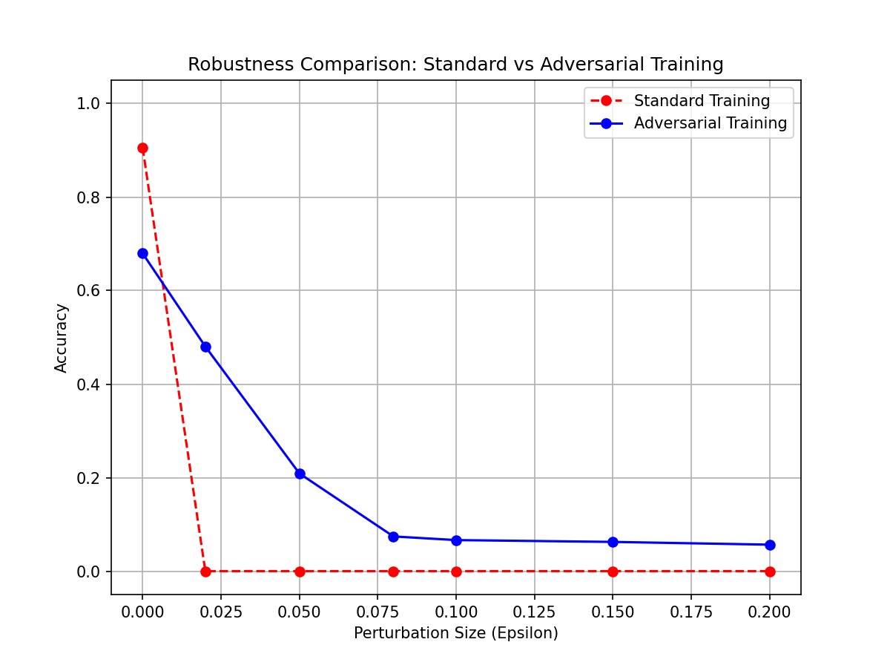

# Neural X-Ray: Adversarial Forensics Lab 🔬

**Can we trust AI explanations when the AI itself is lying?**

This project investigates the reliability of visual interpretability methods (GradCAM, Integrated Gradients, SHAP) under adversarial attacks. We propose a forensic framework to **detect** attacks by analyzing the stability of these explanations.



## 📌 Project Overview
- **Goal:** Detect Adversarial Attacks (FGSM/PGD) on CIFAR-10 classifiers.
- **Method:** Compare Saliency Maps of "Clean" vs "Attacked" images using SSIM (Structural Similarity Index).
- **Key Finding:** While model confidence is easily fooled (99% confidence on wrong class), the interpretation map "shatters" (Low SSIM), acting as a reliable lie detector.

## 🛠️ Installation

```bash
# 1. Clone the repo
git clone https://github.com/YOUR_USERNAME/neural-x-ray.git
cd neural-x-ray

# 2. Install dependencies
pip install -r requirements.txt
```

## 🚀 Usage

### Run the App (Streamlit)
The easiest way to explore the project is the interactive dashboard:
```bash
python -m streamlit run streamlit_app.py
```

### Reproduce Experiments
To retrain models and generate plots:
```bash
# Train models (Standard & Robust)
python -m src.train_adv

# Generate Robustness Plots & Saliency Maps
python -m src.compare_robustness
```

## 📂 Repository Structure
- `src/`: Core logic (Attacks, Models, Metrics).
- `models/`: Pre-trained ResNet-18 models (Standard & Robust).
- `results/`: Generated plots and forensic evidence.
- `streamlit_app.py`: The "Neural X-Ray" dashboard code.

## 👨‍💻 Authors
**Muhammad Talha** | **Zahid Tufail**
Kyung Hee University (CQILAB)
AI Reverse Engineering Semester Project
